# Documentación de Módulos - Landing Page FCH

Esta documentación detalla los 15 bloques/módulos que componen la landing page de la Fundación Consciencia Humana, incluyendo su propósito y contenido textual extraído.

## Hero
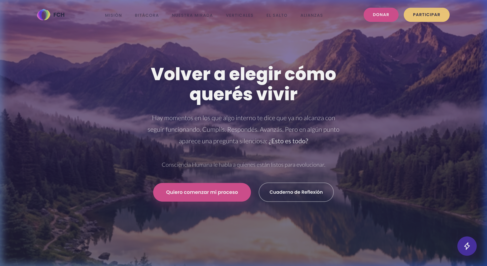

Experiencias transformadoras para un liderazgo consciente. No es solo lo que hacés, sino desde dónde lo hacés. Reinstalamos una conversación más profunda para activar claridad, coherencia y propósito. Quieres comenzar mi proceso. Cuaderno de Reflexión.

---

## Bitácora
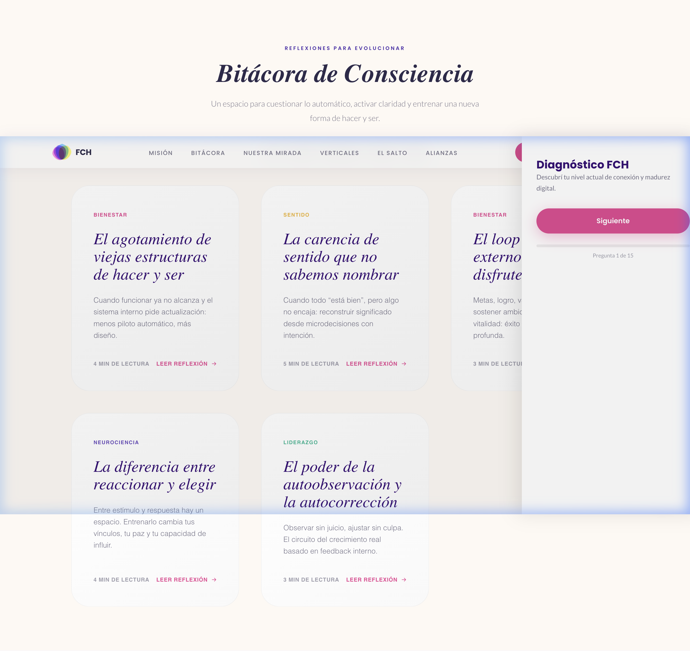

Bitácora de Consciencia. Un espacio para cuestionar lo automático, activar claridad y entrenar una nueva forma de hacer y ser. Bienestar, Neurociencia, Liderazgo y Sentido.

---

## Cuaderno de Reflexión
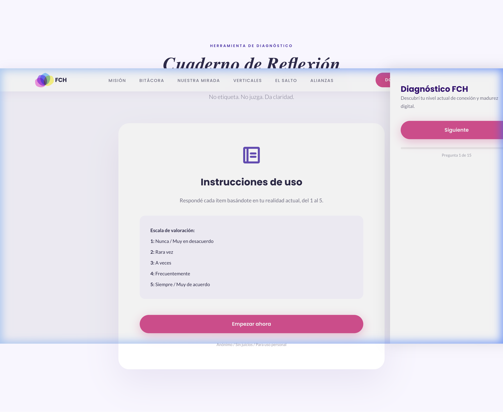

10 minutos. 20 preguntas. Un diagnóstico claro para ordenar tu próximo paso. No etiqueta. No juzga. Da claridad.

---

## Nuestra Misión
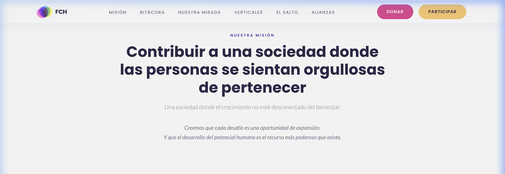

Contribuir a una sociedad donde las personas se sientan orgullosas de pertenecer. Una sociedad donde el crecimiento no esté desconectado del bienestar.

---

## Nuestra Mirada
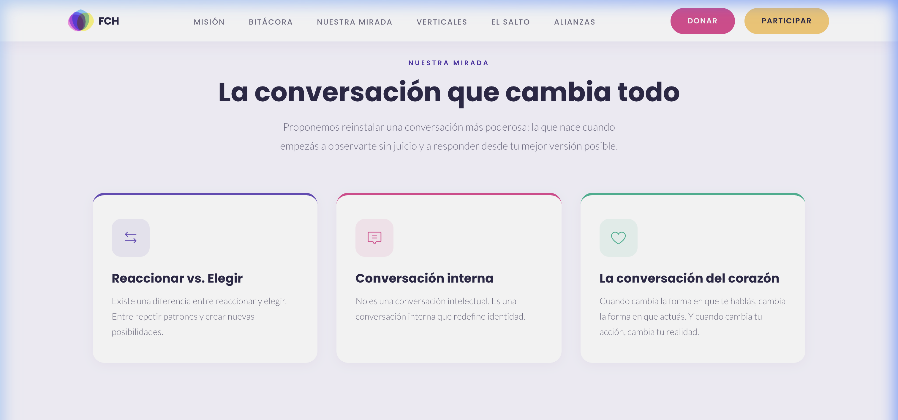

La conversación que cambia todo. Reinstalamos una conversación más profunda para activar claridad, coherencia y propósito en líderes y organizaciones.

---

## Transformación Real
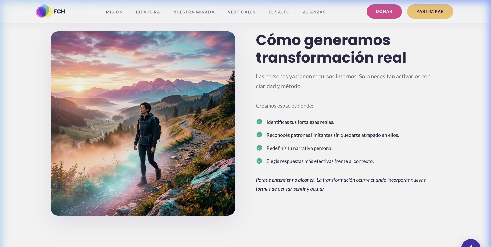

Las personas ya tienen recursos internos. Solo necesitan activarlos con claridad y método. Nuestra metodología integra neurociencia aplicada, dinámicas experienciales y herramientas de gestión emocional.

---

## El Protagonista
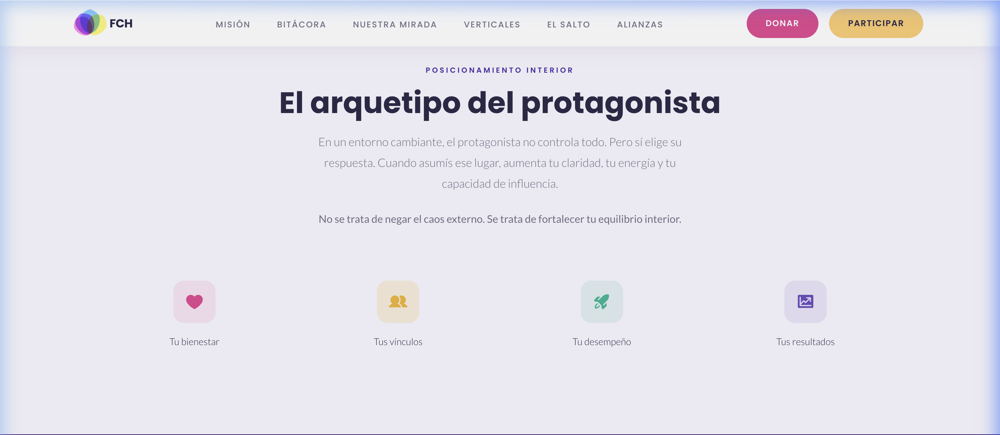

El posicionamiento interior determina el resultado exterior. Trabajamos en la raíz de la conducta: el observador que somos y la responsabilidad personal como motor de cambio.

---

## Dónde Actuamos
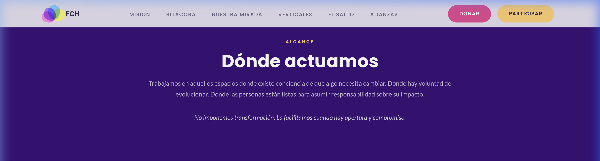

Intervenimos en entornos de alta complejidad donde el factor humano es determinante para el éxito y la sostenibilidad de los proyectos.

---

## Verticales de Acción
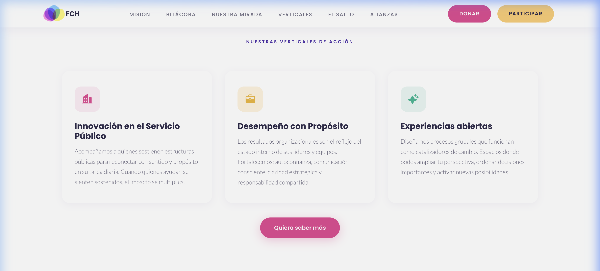

Innovación en Servicio Público. Desempeño con Propósito. Experiencias Abiertas.

---

## El Salto de Tu Vida
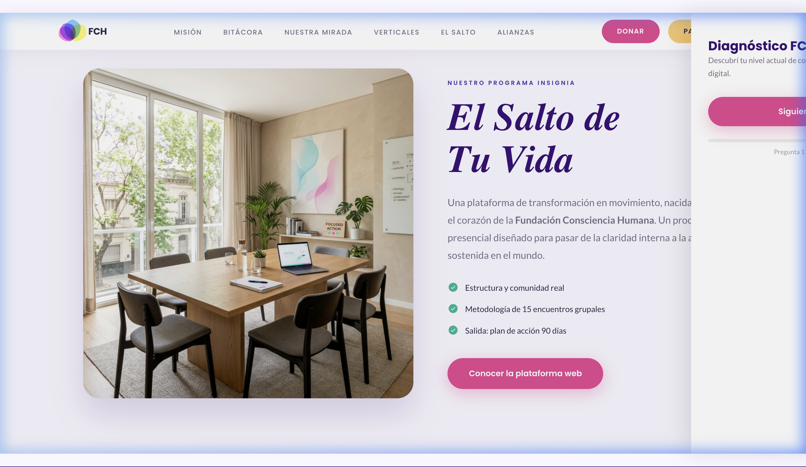

Una plataforma de transformación en movimiento... diseñada para pasar de la claridad interna a la acción sostenida. El programa insignia para quienes buscan liderar con sentido.

---

## Resultados
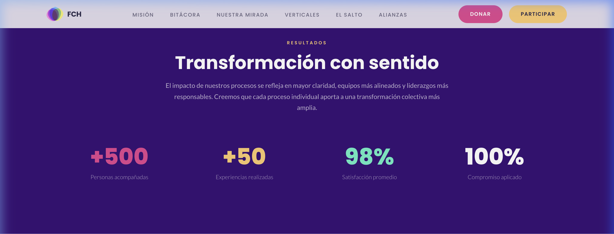

500+ personas impactadas. 50+ experiencias realizadas. 98% índice de satisfacción.

---

## Alianzas
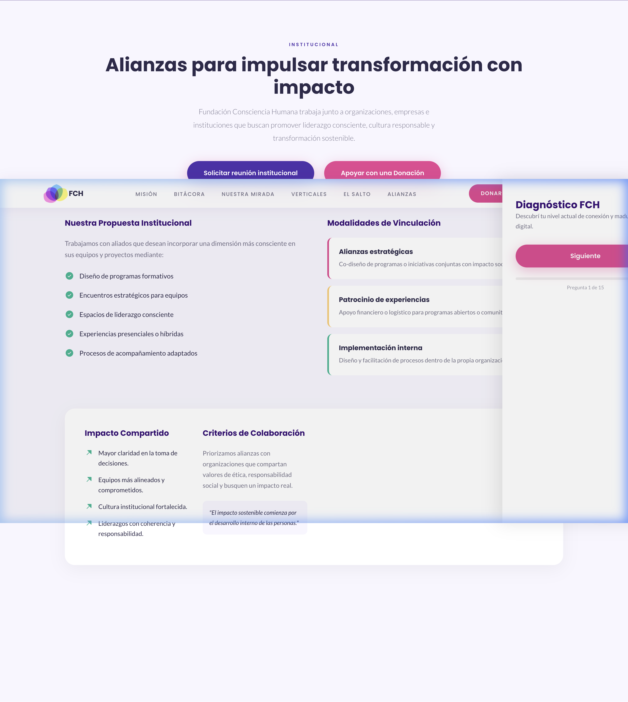

Información para socios institucionales y modalidades de vinculación. Unimos fuerzas con organizaciones que comparten nuestra visión de un futuro más consciente.

---

## El Equipo
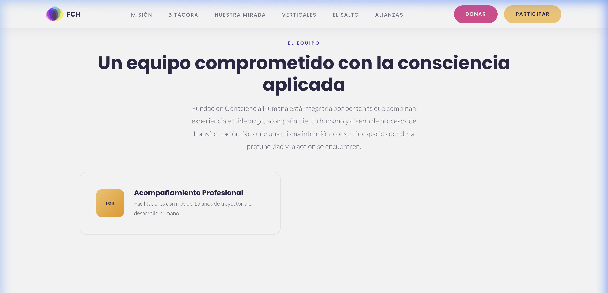

El equipo profesional de FCH. Un grupo multidisciplinario apasionado por el desarrollo humano y la transformación organizacional.

---

## Colaboración
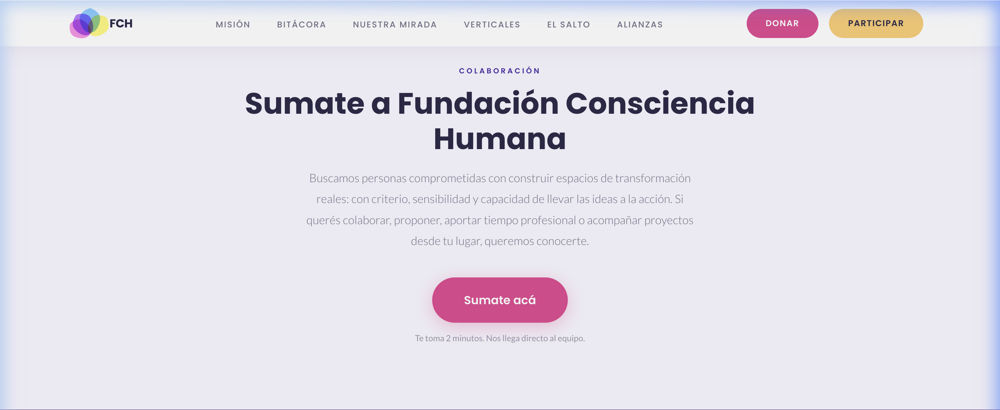

Invitación a sumarse al equipo o proponer proyectos. Tu talento puede ser el motor de la próxima gran transformación.

---

## CTA Final
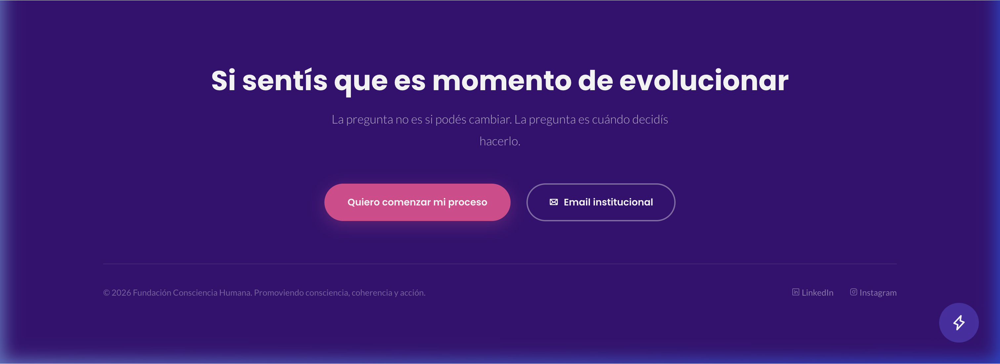

Si sentís que es momento de evolucionar... La pregunta no es si podés cambiar. La pregunta es cuándo decidís hacerlo. Contacto. Redes Sociales.
